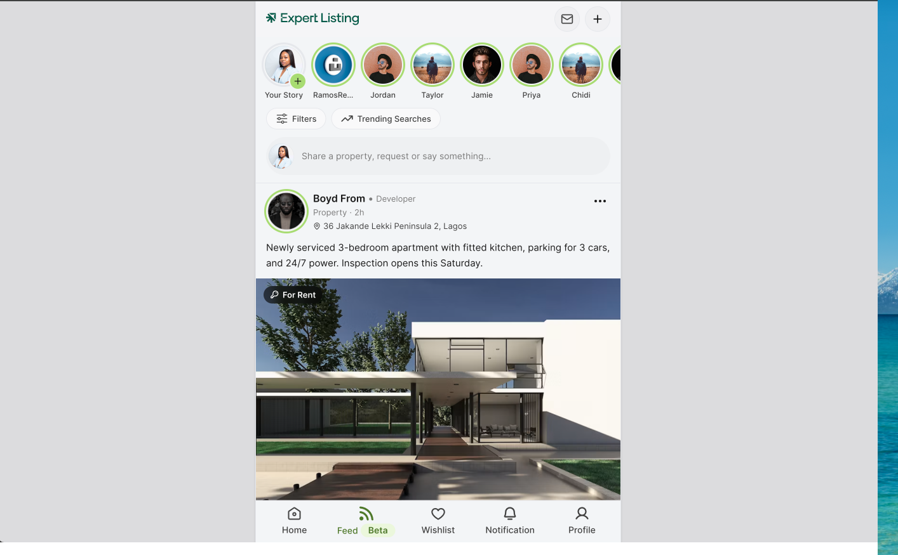

# Expert Listing - Frontend Assessment

A close copy of the "Expert Listing" property feed, built with Next.js (App Router), TypeScript, Tailwind CSS v4, and shadcn/ui.



## How to run

```bash
pnpm install
pnpm dev
```

Then open [http://localhost:3000](http://localhost:3000).

Other scripts:

```bash
pnpm build   # production build
pnpm start   # run the production build
pnpm lint    # eslint
```

## Technology choices

- **Next.js App Router + TypeScript** - required by the brief. The page has no data fetching, so it builds as a static page.
- **Tailwind CSS v4** - came with `create-next-app`. All styling uses design tokens set in `app/globals.css` (brand green, muted surfaces, etc.), so colors are never hard-coded in a component.
- **shadcn/ui** - a few accessible pieces (`Avatar`, `Separator`, `Skeleton`, `Button`), restyled with Tailwind to match the design. It copies plain component code into the repo instead of adding a runtime dependency, which keeps things light and fully editable.
- **@iconify/react** - the icon set used everywhere (header, nav, engagement bar, media tags), matching the icon library used in the Figma file. Icons load by name at runtime, so no icon files are bundled.
- **Open Runde** - the font used in the design. It isn't on Google Fonts, so it's self-hosted via `next/font/local` (SIL OFL license).
- **No backend, no state library** - the brief rules out backend work. All content lives in `lib/mock-data.ts`. Things like like/save toggles and the active nav tab use plain React state, since there's nothing shared across components that needs more than that.

## Project structure

```
app/                     route entry (page.tsx, layout.tsx, globals.css)
components/
  layout/                app shell, sticky header, sticky bottom nav
  feed/                  stories row, filter pills, composer, post card
                         and its sub-parts (header, media, engagement,
                         liked-by, comments), end-of-feed marker
  ui/                    shadcn primitives
lib/
  types.ts               Post / Story / Author types
  mock-data.ts            static feed content
  format.ts               number formatting (1.2k, 700, etc.)
  utils.ts                 shadcn's cn() helper
```

Each part of a post (avatar, header, media, engagement bar, comments) is its own small component. This keeps the post card simple and lets any one piece change (like swapping the video player) without touching the rest.

## Assumptions & trade-offs

- **Source design**: I worked from the mobile screenshot I was given, since I didn't have edit access to the shared Figma file. Colors, spacing, and text sizes are matched by eye. Happy to fine-tune these against exact Figma values if access is granted.
- **Screens beyond mobile**: the design only shows a mobile screen. Instead of guessing a full desktop layout, the app is centered in a card on tablet and desktop (like how Threads or X show their feed on larger screens). This keeps text readable and avoids stretching a phone layout across a whole monitor. The header and bottom nav stay fixed at every screen size.
- **Media**: property photos and avatars are placeholder images from Unsplash. The video post plays a real, self-hosted short video clip, since no real listing video was provided.
- **Interactions**: like and save toggle with a small animation and are saved in the browser, so they survive a page refresh. The image carousel can be swiped or tapped (left/right half) to change photos. The video has a play/pause button. All buttons have hover and press states. None of this talks to a real backend - it's all local, on-device state.
- **Data**: all posts and stories are made-up sample content in `lib/mock-data.ts`, not real listings.

## Deployment

Live at [expertng-assessment-ui.vercel.app](https://expertng-assessment-ui.vercel.app/).

To deploy your own copy, import this repo at vercel.com/new. No extra setup is needed - it's a standard Next.js app.
